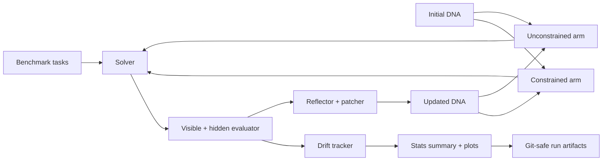

# ReGenesis

[](https://www.python.org/)
[](LICENSE)
[](https://github.com)

A research benchmark for studying recursive self-improvement in language-model agents under controlled evolutionary conditions.

ReGenesis compares a constrained and unconstrained self-modifying agent across repeated lineages to measure how editing freedom changes performance, drift, and stability over time.

## TL;DR

- Evaluates whether self-modifying agents improve under different editing constraints
- Runs repeated independent lineages with seeded task ordering for cleaner comparisons
- Tracks visible performance, hidden performance, and semantic drift over generations
- Produces benchmark summaries and reproducible metadata without committing secrets

## Why this project exists

Modern agent systems can update their own prompts, strategy metadata, and reflection policies. The key question is not just whether they improve, but whether those improvements are stable, repeatable, and meaningfully different from baseline behavior.

ReGenesis is built to answer that with a controlled benchmark structure:

- repeated independent runs per arm
- same benchmark tasks across all runs
- fixed scoring rules and hidden evaluation
- explicit drift tracking from the initial generation
- constrained vs unconstrained editing-policy comparison

## Architecture overview



## What it measures

- visible task performance across generations
- hidden-task performance
- improvement relative to the starting generation
- semantic drift from the initial DNA
- regression and instability events
- repeat-level independence and reproducibility

## Verified benchmark results

The latest experiment produced the following comparison statistics:

| Metric | Constrained | Unconstrained | Effect size | p-value |
| --- | ---: | ---: | ---: | ---: |
| Final visible pass rate | 0.9100 | 0.9600 | Cohen's d = -1.168 | 0.0197 |
| Final hidden pass rate | 0.8701 | 0.8940 | Cohen's d = -1.113 | 0.0258 |
| Improvement over starting generation | 0.0100 | 0.0600 | Cohen's d = -1.168 | 0.0197 |
| Final drift from generation 0 | 0.9372 | 0.9835 | Cohen's d = -0.711 | 0.1455 |
| Solution drift | 0.2394 | 0.2182 | Cohen's d = 0.279 | 0.5423 |
| Regression events | 0.0000 | 0.0000 | — | — |

Interpretation: in this run, the unconstrained arm shows a measurable advantage on visible and hidden performance, while the drift signal remains exploratory and should be interpreted cautiously until larger repeat counts are used.

## Key files

- [app.py](app.py) — generation loop, evaluation flow, DNA updates, and repeat-aware execution
- [run_all.py](run_all.py) — top-level orchestration, repeat seeding, task ordering, validation checks
- [config.py](config.py) — benchmark configuration, seed values, and output paths
- [agent/dna.py](agent/dna.py) — mutable DNA model and evolutionary state
- [agent/solver.py](agent/solver.py) — task-solving logic for each generation
- [reflection/reflector.py](reflection/reflector.py) — patch proposal and reflection logic
- [database/db.py](database/db.py) — SQLite schema and generation logging
- [analyze_stats.py](analyze_stats.py) — statistical summary and significance tests
- [experiments/plot_results.py](experiments/plot_results.py) — plot generation for project results
- [benchmarks/tasks.json](benchmarks/tasks.json) — benchmark tasks used in the comparison

## Project outputs

These artifacts are generated at runtime and excluded from Git:

- `data/runs.db` — raw generation-level results for every arm and repeat
- `data/stats_summary.txt` — summary statistics and significance tests
- `data/experiment_metadata.json` — run metadata, seed values, and configuration summary
- `data/dna_versions/` — DNA snapshots by arm and repeat
- `data/plots/results.png` — comparative plots of pass rate and drift over generations

> Sensitive values such as API keys are never committed to the repository. Keep them in local environment variables only.

## Run it locally

```bash
pip install -r requirements.txt

# local-only credentials; do not commit these values
export ANTHROPIC_API_KEY=...
# or
export OPENAI_API_KEY=...

# estimate scale and cost before a full run
python run_all.py --estimate

# full benchmark run
python run_all.py
```

You can tune experiment scale in `config.py` with:

- `NUM_REPEATS`
- `NUM_GENERATIONS`
- `TASKS_PER_GENERATION`

## Repository hygiene

- generated experiment artifacts are ignored by Git
- local credentials remain environment-scoped only
- the benchmark logic remains distinct from repeat-seeding and run metadata logic

## Notes

This project was cleaned up to remove stale experiment-note artifacts that were no longer used by the active benchmark pipeline, leaving only the files that are relevant to the current implementation.

## License

This project is distributed under the MIT license. See [LICENSE](LICENSE) for details.